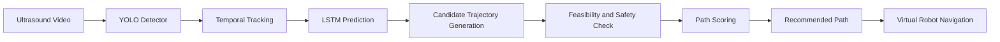

# UltraBot – AI-Assisted Breast Ultrasound Lesion Tracking and Virtual Biopsy Trajectory Planning

[](https://www.python.org/)
[](https://pytorch.org/)
[](https://streamlit.io/)
[](#12-current-implementation-status)
[](#16-disclaimer)

Final-year B.Tech CSE research prototype for **YOLO-based lesion detection**, **temporal tracking**, **LSTM motion prediction**, and **2D virtual biopsy trajectory planning** on breast ultrasound video.

The dashboard runs the implemented pipeline on a selected clip and reports only quantities computed from that run. It is a **virtual simulation**. It is not a clinical device and is not connected to a physical robot.

---

## 1. Project Title

**UltraBot – AI-Assisted Breast Ultrasound Lesion Tracking and Virtual Biopsy Trajectory Planning**

---

## 2. Short Description

UltraBot processes a breast ultrasound video frame by frame. A YOLO-based detector localizes a lesion, a center/IoU tracker associates real detections over time, and an LSTM predicts the next image-plane position after enough consecutive hits. Those coordinates drive a 2D planner that generates candidate needle trajectories, checks reach and safety, scores feasible paths, and selects a recommended path. A Streamlit dashboard visualizes the run and animates a virtual needle along that recommended trajectory.

---

## 3. Key Features

| Feature | What the repository implements |
| --- | --- |
| YOLO-based lesion detection | Ultralytics YOLO inference on each frame using `models/best.pt`; classes from the detector (`benign` / `malignant` in `data.yaml`) |
| Temporal lesion tracking | `CenterIoUTracker` associates real boxes with IoU and nearest-center distance; missed frames coast without inventing centers |
| LSTM future-position prediction | 3-layer LSTM (hidden size 128) predicts a 2D velocity after 20 consecutive real detections on the same track |
| Biopsy trajectory generation | Border entry points are paired with lesion / LSTM targets and scored in the ultrasound pane |
| Shortest / safest / recommended selection | Taken from the optimizer output: shortest feasible path, safest feasible path, and lowest-cost (recommended) path |
| Virtual biopsy navigation | **NAVIGATE RECOMMENDED PATH** sends the optimizer path to the robot tab |
| 2D virtual robot simulation | Animates a virtual needle along the captured recommended path; SUCCESS only if the tip reaches the target within the safety margin |
| Streamlit research dashboard | Video run, detection/tracking tables, LSTM plots, planning overlay, ranked candidate table, and robot GIF |

Manual Advanced-options entry/target sliders update a **separate** manual trajectory. They do not overwrite the optimizer’s recommended path.

---

## 4. System Architecture



**Pipeline in the dashboard**

Ultrasound Video → YOLO Detector → Temporal Tracker → LSTM Prediction → Trajectory Optimizer → Virtual Biopsy → Robot Simulation

The `yolov13/` tree is present in the repository as a later integration target. The live Streamlit / CLI pipeline loads `models/best.pt` through Ultralytics YOLO and does **not** currently wire YOLOv13 into `run_pipeline`.

---

## 5. Methodology

### 5.1 YOLO-based detection

Each resized ultrasound pane is passed to YOLO (`ultralytics.YOLO`) with a user-set confidence threshold (dashboard default 0.10). Boxes are converted to axis-aligned `xyxy` coordinates, confidence, class id/name, and a raw box-center. Empty detections are stored as misses; no fake box is inserted.

### 5.2 Temporal tracking

`CenterIoUTracker` (`ultrabot/tracker.py`) is a greedy multi-object tracker:

- Association cost mixes IoU and center distance (defaults: min IoU 0.10, max center distance 90 px).
- Unmatched detections start new tracks.
- Unmatched tracks **coast** for up to 8 missed frames, then become `lost`.
- During a miss, the last real center is **not** interpolated or replaced with a sinusoidal path.
- The primary track is the live track with the most hits.

### 5.3 LSTM prediction

`LSTMModel` (`ultrabot/pipeline.py`) matches the stored checkpoint:

- Input: sequence of 20 consecutive normalized `(x, y)` centers
- Architecture: 3-layer LSTM, hidden size 128, dropout 0.2, then Linear 128→64→2
- Output: predicted velocity; next center = current center + velocity, then clamped to the pane

The LSTM runs only when that track has 20 consecutive real detections. One-step error is prediction at frame *t* versus the next real associated center at *t+1* on the same track.

### 5.4 Trajectory planning and scoring

`optimize_biopsy_paths` (`ultrabot/biopsy.py`) enumerates workspace-border entries × candidate targets, evaluates each pair with `plan_biopsy`, drops infeasible rows, min-max normalizes metrics over **feasible** paths only, and ranks by weighted cost. Details are in [§6](#6-trajectory-planning).

### 5.5 Virtual robot navigation

`run_robot_simulation` (`ultrabot/robot_sim.py`) interpolates a needle tip along the **captured recommended** entry→target segment, clipped by needle length, and writes a GIF. SUCCESS requires the final tip to lie within the configured safety margin of the planned target.

---

## 6. Trajectory Planning

Planning is a **2D image-plane simulation** on a real ultrasound frame. It is not a validated surgical planner.

### Candidate generation

- **Entries:** points on the pane border (`candidate_entries`, default margin 24 px, step 90 px).
- **Targets:** tracked lesion center, LSTM predicted center when available, and a few nearby samples inside the safety radius.

### Quantities (computed, not invented)

| Quantity | Definition in code |
| --- | --- |
| Path length | Euclidean distance from entry to target (px) |
| Needle angle | `atan2(dy, dx)` in the image plane (degrees) |
| Target error | Distance from planned target to lesion center (px), if a lesion exists |
| Safety | `0` if target error ≤ safety margin, else `1` |
| Feasible | Lesion exists, path length ≥ 16 px, and needle length ≥ path length |
| Score | Weighted sum of min-max normalized path length, \|angle\|/180, target error, and safety violations |

### Path identities (from optimizer output)

| Identity | Selection rule |
| --- | --- |
| Shortest feasible | Minimum path length among feasible candidates |
| Safest feasible | Fewest safety violations, then lowest target error |
| Recommended (balanced) | Lowest `total_cost`, then shorter path as tie-break (`ranked[0]`) |

Dashboard weights (path length, safety, angle, target accuracy) re-score candidates and update the recommended path. Needle length and safety margin also enter feasibility / safety scoring.

**Navigation:** **NAVIGATE RECOMMENDED PATH** snapshots that recommended trajectory and passes it to Robot Simulation. The robot does not follow the manual Advanced-options path.

---

## 7. Technology Stack

| Layer | Technologies actually used |
| --- | --- |
| Language | Python |
| Deep learning | PyTorch, Ultralytics YOLO, LSTM (`torch.nn.LSTM`) |
| Vision / video | OpenCV, Pillow |
| Numerics | NumPy |
| Dashboard | Streamlit, Plotly, Pandas |
| Notebook / plotting | Jupyter, Matplotlib (also listed in `requirements.txt`) |
| Other listed deps | scikit-learn, tqdm |

---

## 8. Dataset

This repository prepares data in a **BUSV-style breast ultrasound video** layout. That is indicated by `busv.ipynb`, `notebook_code.txt`, and the ignored `BUSV_Dataset/` path. The files in this repo document the following, and nothing beyond them:

- Frames grouped under `rawframes/{benign,malignant}/<video_id>/`.
- ImageNet-VID-style JSON (`imagenet_vid_train_15frames.json`, `imagenet_vid_val.json`) with `videos`, `images`, and `annotations` (`bbox`, `category_id`).
- Conversion to YOLO labels: class `0` **benign**, class `1` **malignant** (`data.yaml`).
- Image / label split used in the notebook: 80% train / 20% val into `dataset/images/{train,val}` and `dataset/labels/{train,val}`.
- The notebook also builds a sample clip (`busi_video.mp4` / `busi_video.avi`) from validation frames. The dashboard default sample path is `outputs/input.mp4`.

`dataset/` and weight files are gitignored. This README does **not** state official dataset size, paper metrics, or a MICCAI challenge score, because those numbers are not stored here.

---

## 9. Project Structure

```text
UltraBot-Trajectory-Tracking/
├── app.py                      # Streamlit research dashboard
├── data.yaml                   # YOLO data config (benign / malignant)
├── requirements.txt
├── busv.ipynb                  # Original notebook (older local paths)
├── notebook_code.txt           # Extracted notebook cells
├── ultrabot/                   # Shared pipeline (dashboard + CLI)
│   ├── pipeline.py             # YOLO detect → track → LSTM
│   ├── tracker.py              # Center / IoU tracker
│   ├── biopsy.py               # 2D planning, scoring, overlay
│   ├── robot_sim.py            # Virtual needle animation
│   ├── metrics.py              # Per-run statistics
│   └── render.py               # HUD drawing
├── scripts/
│   └── run_demo.py             # CLI HUD demo
├── models/                     # Local weights (gitignored)
│   ├── best.pt                 # YOLO weights used by the pipeline
│   └── lstm_checkpoint.pth
├── dataset/                    # YOLO images/labels (gitignored)
│   ├── images/train|val
│   └── labels/train|val
├── outputs/                    # Sample / generated video and dashboard artifacts
├── yolov13/                    # YOLOv13 source tree (not wired into Streamlit)
└── .streamlit/config.toml
```

There is no separate top-level `annotations/` or `results/` directory. YOLO labels live under `dataset/labels/`. Run artifacts are written under `outputs/` (and `outputs/dashboard/` by the app).

---

## 10. Installation

Windows (PowerShell), from the project root:

```powershell
python -m venv .venv
.\.venv\Scripts\activate
python -m pip install --upgrade pip
pip install -r requirements.txt
```

Place the following local files before running analysis (they are gitignored):

- `models/best.pt`
- `models/lstm_checkpoint.pth`
- a sample ultrasound video, e.g. `outputs/input.mp4`

GPU is optional. The dashboard reports CPU or CUDA from the current PyTorch install.

---

## 11. Running the Dashboard

```powershell
streamlit run app.py
```

Then:

1. Under **DATA**, choose a sample video or upload an MP4/AVI/MOV clip.
2. Set **Max frames** (start with 40 on CPU) and the YOLO **Confidence** threshold.
3. Click **RUN ANALYSIS**.
4. Inspect Overview, Detection & Tracking, Temporal Prediction, Trajectory Planning, Virtual Biopsy, and Robot Simulation.
5. In Trajectory Planning, adjust planning weights if needed, then click **NAVIGATE RECOMMENDED PATH**.

### CLI demo (same `ultrabot.pipeline`)

```powershell
python scripts/run_demo.py --max-frames 120
```

Default output: `outputs/ultrabot_live.mp4`.

`busv.ipynb` still contains older absolute paths (`runs/detect/train8/...`, `busi_video.avi`). Prefer the dashboard or CLI for a working run.

---

## 12. Current Implementation Status

| Component | Status in this repository |
| --- | --- |
| Streamlit dashboard | Implemented |
| YOLO inference via Ultralytics + `models/best.pt` | Implemented |
| Temporal center/IoU tracking | Implemented |
| LSTM next-step prediction | Implemented |
| Candidate generation, feasibility, weighted scoring | Implemented |
| Shortest / safest / recommended identities | Implemented from optimizer output |
| Virtual biopsy overlay + ranked table | Implemented |
| 2D robot GIF along recommended path | Implemented |
| Per-clip run metrics in the dashboard | Implemented |
| Official mAP / precision / recall report stored with weights | **Not present** |
| Held-out tracking ADE/FDE report | **Not present** |
| YOLOv13 wired into `app.py` / `run_pipeline` | **Not connected** (`yolov13/` is vendored for later work) |
| Physical robot or ultrasound machine control | **Not implemented** |

---

## 13. Evaluation

### Implemented on each dashboard run

These are computed from the clip just processed (`ultrabot/metrics.py` and the planner/simulator). They are **not** published challenge scores.

| Metric | Meaning |
| --- | --- |
| Detection coverage | Frames with a YOLO box / processed frames (not mAP) |
| Mean confidence | Mean detector score on detected frames |
| Track length / misses / coasting | Primary-track association statistics |
| Center displacement | Distance between consecutive real centers on the same track |
| LSTM one-step error | Predicted center at *t* vs next real center at *t+1* (px), when both exist |
| Path length, angle, target error, safety, score | Planner outputs for ranked / recommended paths |
| Simulation SUCCESS / FAILURE | Simulated tip within safety margin of the planned target |

### Not available in this workspace

- Official validation mAP, precision, or recall for `models/best.pt`
- A stored ADE/FDE tracking benchmark

### Planned for a later stage

Held-out detection metrics and a comparison after YOLOv13 is actually integrated. No numbers are claimed until those reports exist in the repository.

---

## 14. Limitations

- Virtual 2D simulation on ultrasound images only.
- Not a clinical diagnostic or treatment system.
- Not connected to a physical biopsy robot or scanner.
- No real patient intervention.
- Tracker and LSTM use image-plane pixels, not 3D probe geometry.
- Planning cost weights are a transparent ranking heuristic, not a clinically validated objective.
- Results require further independent evaluation before any research claim about detector accuracy.

---

## 15. Future Work

- Wire and evaluate YOLOv13 from `yolov13/` inside the same Streamlit / CLI pipeline.
- Add stored quantitative detection and tracking evaluation (mAP-style detection metrics; ADE/FDE or equivalent tracking metrics) on a held-out split.
- Stronger 2D robotic simulation (clearer kinematics, richer failure cases).
- Cleaner dataset packaging so BUSV conversion does not depend on machine-specific notebook paths.
- Optional 3D / probe-aware planning is out of scope of the current code.

---

## 16. Disclaimer

This software is an **academic research prototype** for computer-science demonstration and education.

It is **not** a medical device. It is **not** intended for diagnosis, screening, biopsy guidance, or any clinical decision. Outputs are simulated 2D trajectories on digital ultrasound frames. They must not be used to plan or perform a procedure on a patient.

No clinical validation has been completed in this repository. Any deployment in a healthcare setting would require independent regulatory, ethical, and clinical review that this project does not provide.

---

## 17. Team / Academic Project

B.Tech Computer Science and Engineering — final-year academic project.

**Author:** Eshita Gupta

Virtual biopsy and robot overlays in the app include the in-code notices:

- *Virtual biopsy trajectory simulation — not clinical or robotic control.*
- *Virtual robotic biopsy simulation — not clinical or robotic control.*
